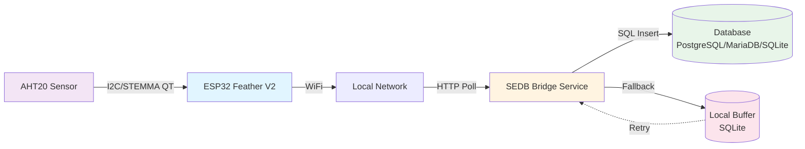
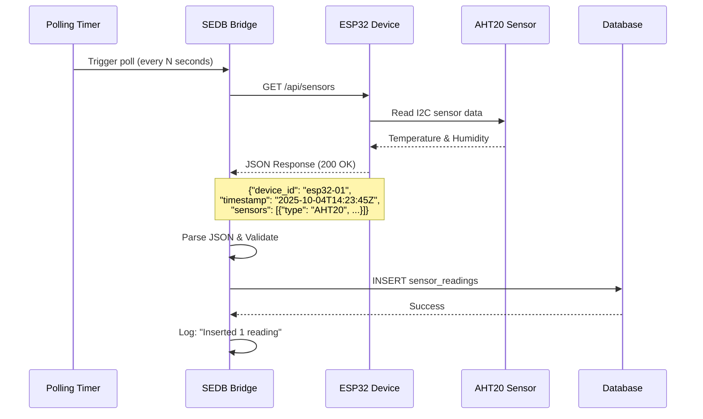
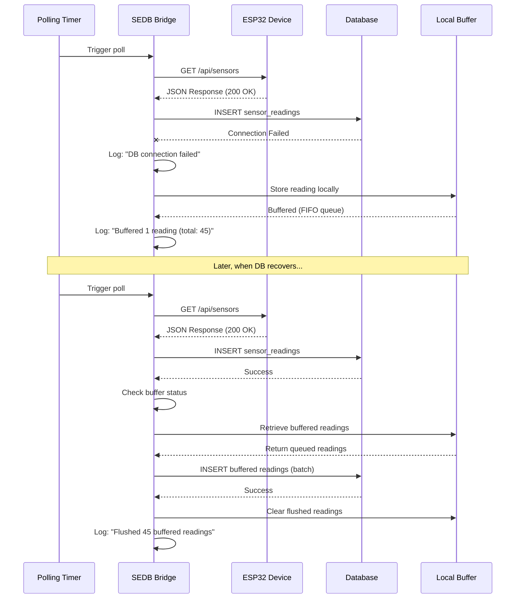
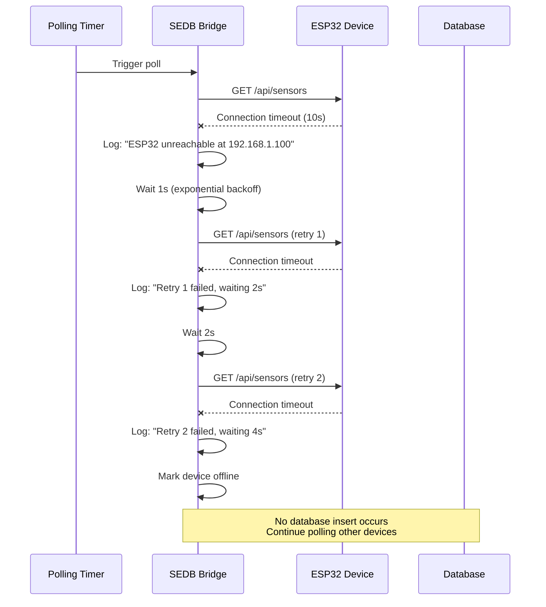
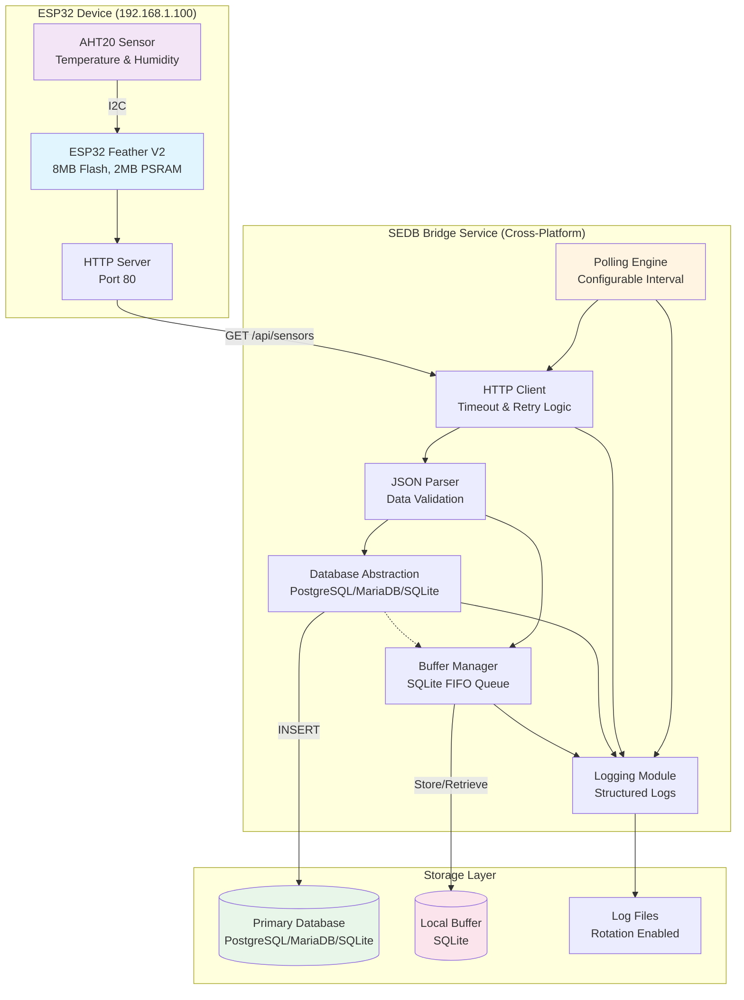
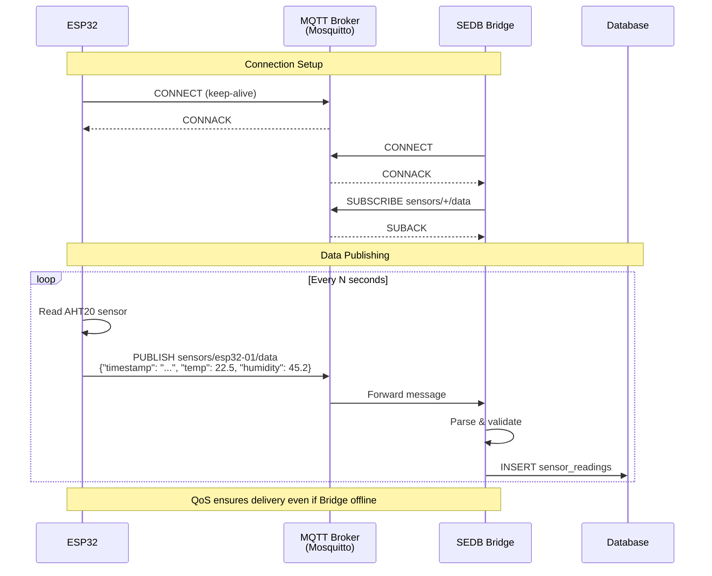

# Small Electronic Device Bridge (SEDB) - Requirements Document

## Project Overview

A cross-platform polling bridge service that periodically connects to ESP32 devices on the local network, retrieves sensor data, and persists it to a configured database with local buffering and comprehensive logging.

**Design Philosophy**: Simple, self-contained, and locally-operated solution that requires no commercial cloud services, external dependencies, or complex platforms like Home Assistant. Low power consumption on both ESP32 devices and bridge host.

## 1. Functional Requirements

### 1.1 Core Functionality
- **FR-1.1**: Poll ESP32 device(s) at configurable intervals (minimum 1 second, no upper limit)
- **FR-1.2**: Retrieve temperature and humidity data from Adafruit AHT20 sensor
- **FR-1.3**: Store sensor readings in target database with timezone-aware timestamps
- **FR-1.4**: Support multiple database backends: PostgreSQL, MariaDB, SQLite
- **FR-1.5**: Buffer data locally when database connectivity is lost
- **FR-1.6**: Automatically flush buffered data when connectivity is restored

### 1.2 Configuration
- **FR-2.1**: Configure polling interval in seconds via configuration file
- **FR-2.2**: Configure ESP32 device IP address(es)
- **FR-2.3**: Configure database connection parameters (type, host, port, credentials, database name)
- **FR-2.4**: Configure sensor types and data fields (extensible for future sensors)
- **FR-2.5**: Configure logging level and output destination
- **FR-2.6**: Support configuration reload without service restart (optional enhancement)

### 1.3 Logging
- **FR-3.1**: Log all polling attempts (success/failure)
- **FR-3.2**: Log database connection status changes
- **FR-3.3**: Log ESP32 connectivity failures
- **FR-3.4**: Log count of readings collected per polling cycle
- **FR-3.5**: Log count of readings successfully inserted to database
- **FR-3.6**: Log count of readings buffered locally
- **FR-3.7**: Log service start/stop events
- **FR-3.8**: Include timestamps in all log entries

### 1.4 Extensibility
- **FR-4.1**: Design data model to accommodate additional sensor types
- **FR-4.2**: Support multiple sensors per ESP32 device
- **FR-4.3**: Support multiple ESP32 devices
- **FR-4.4**: Plugin or configuration-based sensor definition system

## 2. Non-Functional Requirements

### 2.1 Performance
- **NFR-1.1**: Run in ≤ 50MB of RAM under normal operation
- **NFR-1.2**: Support polling intervals as low as 1 second without data loss
- **NFR-1.3**: Handle local buffer of at least 10,000 readings

### 2.2 Platform Support
- **NFR-2.1**: Run on Windows (x64)
- **NFR-2.2**: Run on macOS (Intel and Apple Silicon)
- **NFR-2.3**: Run on Linux AMD64
- **NFR-2.4**: Run on Linux ARM (32-bit and 64-bit for Raspberry Pi)
- **NFR-2.5**: Distribute as single executable or minimal dependency package

### 2.3 Service Integration
- **NFR-3.1**: Run as Windows Service
- **NFR-3.2**: Run as systemd service on Linux
- **NFR-3.3**: Run as launchd daemon on macOS
- **NFR-3.4**: Run as foreground process for development/testing

### 2.4 Reliability
- **NFR-4.1**: Graceful degradation when ESP32 is unreachable
- **NFR-4.2**: Graceful degradation when database is unreachable
- **NFR-4.3**: Automatic reconnection attempts with exponential backoff
- **NFR-4.4**: No data loss for readings taken while database is unavailable
- **NFR-4.5**: Recover from crashes (when run as service)

### 2.5 User Interface
- **NFR-5.1**: No GUI required at this time
- **NFR-5.2**: Command-line interface for service management (install, start, stop, status)
- **NFR-5.3**: All operational visibility through logs

### 2.6 Simplicity and Independence
- **NFR-6.1**: No dependency on commercial cloud services (AWS IoT, Azure IoT, Google Cloud IoT)
- **NFR-6.2**: No dependency on third-party platforms (Home Assistant, Node-RED, Domoticz, etc.)
- **NFR-6.3**: Self-contained operation with minimal external dependencies
- **NFR-6.4**: All data remains on local network (privacy-focused, air-gapped capable)
- **NFR-6.5**: Simple installation without complex setup procedures
- **NFR-6.6**: No ongoing subscription or licensing fees

### 2.7 Power Efficiency
- **NFR-7.1**: ESP32 firmware optimized for low power consumption between readings
- **NFR-7.2**: Bridge service designed for minimal CPU usage during idle periods
- **NFR-7.3**: Support deep sleep mode on ESP32 for battery-powered deployments (future enhancement)
- **NFR-7.4**: Configurable polling intervals to balance responsiveness and power consumption

## 3. Hardware Specifications

### 3.1 ESP32 Device
- **Model**: Adafruit ESP32 Feather V2
  - 8MB Flash
  - 2MB PSRAM
  - STEMMA QT connector
- **Connectivity**: WiFi (2.4GHz)
- **Network**: Static local IP address
- Product Page: [https://www.adafruit.com/product/5400](https://www.adafruit.com/product/5400)

### 3.2 Sensor(s)
- **Primary Sensor**: Adafruit AHT20 Temperature & Humidity Sensor
  - Interface: I2C via STEMMA QT
  - Data: Temperature (°C), Relative Humidity (%)
- **Future Sensors**: TBD (design must accommodate)
- Product Page: [https://www.adafruit.com/product/4566](https://www.adafruit.com/product/4566)

### 3.3 Bridge Host System
- **Minimum Requirements**:
  - 100MB available RAM
  - 50MB available disk space
  - Network connectivity to ESP32 subnet
  - Network connectivity to database host

## 4. Software Architecture

### 4.1 Components

#### 4.1.1 Polling Engine
- Manages polling schedule based on configured interval
- Handles multiple device polling coordination
- Implements timeout and retry logic

#### 4.1.2 ESP32 Communication Module
- HTTP or MQTT client to fetch data from ESP32
- Parse sensor data from response
- Handle connection failures and timeouts

#### 4.1.3 Database Module
- Abstraction layer supporting PostgreSQL, MariaDB, SQLite
- Connection pooling
- Prepared statements for inserts
- Transaction management

#### 4.1.4 Local Buffer
- Persistent storage (SQLite or file-based)
- FIFO queue for failed database writes
- Automatic retry with backoff
- Disk space management (configurable max size)

#### 4.1.5 Logging Module
- Structured logging with levels (DEBUG, INFO, WARN, ERROR)
- Configurable outputs (stdout, file, syslog)
- Log rotation support

#### 4.1.6 Configuration Manager
- Load configuration from file (YAML, JSON, or TOML)
- Validate configuration on startup
- Provide defaults for optional parameters

#### 4.1.7 Service Wrapper
- Platform-specific service installation and management
- Signal handling for graceful shutdown
- Health check endpoint (optional)

### 4.2 Communication Protocol

#### 4.2.1 System Architecture Overview



#### 4.2.2 HTTP REST API Data Flow

**Normal Operation (Database Available)**



**Error Handling (Database Unavailable)**



**Error Handling (ESP32 Unavailable)**



#### 4.2.3 Component Interaction Diagram



#### 4.2.4 ESP32 API Specification

The ESP32 device must expose an HTTP endpoint:

```
GET /api/sensors
Response:
{
  "timestamp": "2025-10-04T14:23:45Z",
  "device_id": "esp32-aht20-01",
  "sensors": [
    {
      "type": "AHT20",
      "temperature_c": 22.5,
      "humidity_percent": 45.2
    }
  ]
}
```

**Alternative Protocol: MQTT Publish/Subscribe**



#### 4.2.5 Database Schema

```sql
-- Devices table
CREATE TABLE devices (
    device_id VARCHAR(64) PRIMARY KEY,
    device_name VARCHAR(255),
    ip_address VARCHAR(45),
    last_seen TIMESTAMP WITH TIME ZONE,
    created_at TIMESTAMP WITH TIME ZONE DEFAULT CURRENT_TIMESTAMP
);

-- Sensor readings table
CREATE TABLE sensor_readings (
    id BIGSERIAL PRIMARY KEY,
    device_id VARCHAR(64) REFERENCES devices(device_id),
    sensor_type VARCHAR(64),
    timestamp TIMESTAMP WITH TIME ZONE,
    temperature_c DECIMAL(5,2),
    humidity_percent DECIMAL(5,2),
    -- Future sensor fields as JSON or additional columns
    additional_data JSONB,
    recorded_at TIMESTAMP WITH TIME ZONE DEFAULT CURRENT_TIMESTAMP
);

-- Indexes
CREATE INDEX idx_readings_timestamp ON sensor_readings(timestamp DESC);
CREATE INDEX idx_readings_device ON sensor_readings(device_id);
```

### 4.3 Technology Stack (Recommendations)

#### Option 1: Go
- **Pros**: Single binary, excellent cross-platform support, low memory footprint, strong concurrency
- **Cons**: Slightly larger binary size

#### Option 2: Rust
- **Pros**: Maximum performance, memory safety, smallest binary
- **Cons**: Steeper learning curve

#### Option 3: Python
- **Pros**: Rapid development, excellent library support
- **Cons**: Requires runtime, higher memory usage, packaging complexity

**Recommendation**: Go for optimal balance of performance, deployment simplicity, and development velocity

## 5. Data Model

### 5.1 Configuration File Structure

The SEDB bridge supports multiple configuration formats. Below are examples of the same configuration in YAML, JSON, and TOML formats.

#### 5.1.1 YAML Format (Recommended)

```yaml
# config.yaml
# SEDB Bridge Configuration
# Human-readable format with comments support

polling:
  interval_seconds: 60
  timeout_seconds: 10
  retry_attempts: 3
  max_concurrent_polls: 10  # Maximum number of devices to poll in parallel

devices:
  - device_id: "esp32-aht20-01"
    name: "Living Room Sensor"
    ip_address: "192.168.1.100"
    port: 80
    endpoint: "/api/sensors"
    sensors:
      - type: "AHT20"
        fields:
          temperature_c: float
          humidity_percent: float

  - device_id: "esp32-aht20-02"
    name: "Garage Sensor"
    ip_address: "192.168.1.101"
    port: 80
    endpoint: "/api/sensors"
    sensors:
      - type: "AHT20"
        fields:
          temperature_c: float
          humidity_percent: float

database:
  type: "postgresql"  # postgresql, mariadb, or sqlite
  host: "192.168.1.50"
  port: 5432
  database: "sensor_data"
  username: "sedb_user"
  password: "secure_password"
  max_connections: 5
  connect_timeout_seconds: 10
  # For SQLite, use: type: "sqlite" and file_path: "./sensor_data.db"

buffer:
  enabled: true
  storage_path: "./buffer.db"
  max_size_mb: 100
  retry_interval_seconds: 30
  batch_size: 100  # Number of readings to flush at once

logging:
  level: "info"  # debug, info, warn, error
  output: "file"  # stdout, file, syslog
  file_path: "./sedb.log"
  max_size_mb: 50
  max_backups: 5
  compress_rotated: true
```

#### 5.1.2 JSON Format

```json
{
  "polling": {
    "interval_seconds": 60,
    "timeout_seconds": 10,
    "retry_attempts": 3,
    "max_concurrent_polls": 10
  },
  "devices": [
    {
      "device_id": "esp32-aht20-01",
      "name": "Living Room Sensor",
      "ip_address": "192.168.1.100",
      "port": 80,
      "endpoint": "/api/sensors",
      "sensors": [
        {
          "type": "AHT20",
          "fields": {
            "temperature_c": "float",
            "humidity_percent": "float"
          }
        }
      ]
    },
    {
      "device_id": "esp32-aht20-02",
      "name": "Garage Sensor",
      "ip_address": "192.168.1.101",
      "port": 80,
      "endpoint": "/api/sensors",
      "sensors": [
        {
          "type": "AHT20",
          "fields": {
            "temperature_c": "float",
            "humidity_percent": "float"
          }
        }
      ]
    }
  ],
  "database": {
    "type": "postgresql",
    "host": "192.168.1.50",
    "port": 5432,
    "database": "sensor_data",
    "username": "sedb_user",
    "password": "secure_password",
    "max_connections": 5,
    "connect_timeout_seconds": 10
  },
  "buffer": {
    "enabled": true,
    "storage_path": "./buffer.db",
    "max_size_mb": 100,
    "retry_interval_seconds": 30,
    "batch_size": 100
  },
  "logging": {
    "level": "info",
    "output": "file",
    "file_path": "./sedb.log",
    "max_size_mb": 50,
    "max_backups": 5,
    "compress_rotated": true
  }
}
```

#### 5.1.3 TOML Format

```toml
# config.toml
# SEDB Bridge Configuration

[polling]
interval_seconds = 60
timeout_seconds = 10
retry_attempts = 3
max_concurrent_polls = 10

[[devices]]
device_id = "esp32-aht20-01"
name = "Living Room Sensor"
ip_address = "192.168.1.100"
port = 80
endpoint = "/api/sensors"

  [[devices.sensors]]
  type = "AHT20"

    [devices.sensors.fields]
    temperature_c = "float"
    humidity_percent = "float"

[[devices]]
device_id = "esp32-aht20-02"
name = "Garage Sensor"
ip_address = "192.168.1.101"
port = 80
endpoint = "/api/sensors"

  [[devices.sensors]]
  type = "AHT20"

    [devices.sensors.fields]
    temperature_c = "float"
    humidity_percent = "float"

[database]
type = "postgresql"  # postgresql, mariadb, or sqlite
host = "192.168.1.50"
port = 5432
database = "sensor_data"
username = "sedb_user"
password = "secure_password"
max_connections = 5
connect_timeout_seconds = 10

[buffer]
enabled = true
storage_path = "./buffer.db"
max_size_mb = 100
retry_interval_seconds = 30
batch_size = 100

[logging]
level = "info"  # debug, info, warn, error
output = "file"  # stdout, file, syslog
file_path = "./sedb.log"
max_size_mb = 50
max_backups = 5
compress_rotated = true
```

#### 5.1.4 Configuration Format Comparison

**Visual Comparison for the Same Polling Section:**

| Format | Size (bytes) | Readability | Comments | Syntax Complexity |
|--------|--------------|-------------|----------|-------------------|
| **YAML** | 85 | ★★★★★ | Yes | Low (whitespace) |
| **JSON** | 148 | ★★★☆☆ | No | Low (strict) |
| **TOML** | 92 | ★★★★☆ | Yes | Medium |

**When to Use Each:**

- **YAML**: Manual editing, human-centric configuration, CI/CD pipelines
- **JSON**: Programmatic generation, API responses, strict validation needs
- **TOML**: Preference for explicit types, Rust ecosystem, middle ground between YAML/JSON

### 5.2 Sensor Data Structure

```json
{
  "timestamp": "2025-10-04T14:23:45-07:00",
  "device_id": "esp32-aht20-01",
  "readings": [
    {
      "sensor_type": "AHT20",
      "sensor_id": "aht20-01",
      "measurements": {
        "temperature_c": 22.5,
        "humidity_percent": 45.2
      }
    }
  ]
}
```

## 6. Error Handling

### 6.1 ESP32 Connectivity Errors
- **EH-1.1**: Log failure with timestamp and error details
- **EH-1.2**: Retry with exponential backoff (1s, 2s, 4s, 8s, max 60s)
- **EH-1.3**: Continue polling other devices if multiple configured
- **EH-1.4**: Update device.last_seen timestamp only on success

### 6.2 Database Connectivity Errors
- **EH-2.1**: Buffer reading to local storage
- **EH-2.2**: Log database connection failure
- **EH-2.3**: Attempt reconnection on next polling cycle
- **EH-2.4**: Flush buffer when connection restored

### 6.3 Local Buffer Full
- **EH-3.1**: Log warning when buffer reaches 80% capacity
- **EH-3.2**: Log error when buffer is full
- **EH-3.3**: Drop oldest readings (FIFO) if max size exceeded
- **EH-3.4**: Option to pause polling when buffer full (configurable)

### 6.4 Invalid Sensor Data
- **EH-4.1**: Log parsing errors with raw data
- **EH-4.2**: Skip invalid readings
- **EH-4.3**: Continue processing other sensors/devices

## 7. Security Considerations

### 7.1 Network Security
- **SEC-1.1**: Support HTTPS for ESP32 communication
- **SEC-1.2**: Support TLS for database connections
- **SEC-1.3**: Validate SSL certificates (with option to disable for development)

### 7.2 Credential Management
- **SEC-2.1**: Store database credentials securely (not plain text)
- **SEC-2.2**: Support environment variable override for credentials
- **SEC-2.3**: Restrict configuration file permissions (owner read/write only)

### 7.3 Data Integrity
- **SEC-3.1**: Validate sensor data ranges (sanity checks)
- **SEC-3.2**: Prevent SQL injection via prepared statements
- **SEC-3.3**: Atomic database transactions

### 7.4 Privacy and Data Sovereignty
- **SEC-4.1**: All data stored locally, never transmitted to external services
- **SEC-4.2**: No telemetry or analytics sent to third parties
- **SEC-4.3**: Operate completely offline (air-gapped networks supported)
- **SEC-4.4**: No phone-home behavior or version checking (unless explicitly enabled)

## 8. Testing Requirements

### 8.1 Unit Tests
- Configuration parsing and validation
- Data model serialization/deserialization
- Database abstraction layer
- Buffer management
- Retry logic

### 8.2 Integration Tests
- ESP32 communication (mock server)
- Database operations (all three backends)
- Local buffer persistence
- Service installation/management

### 8.3 System Tests
- End-to-end polling cycle
- Network failure scenarios
- Database failure scenarios
- Multi-device polling
- Long-duration stability test (24+ hours)

### 8.4 Platform Tests
- Verify operation on all target platforms
- Service installation on each platform
- Memory usage profiling

## 9. Deployment

### 9.1 Packaging
- Single executable binary per platform
- Include sample configuration file
- Include README with setup instructions
- Include systemd/Windows Service installation scripts

### 9.2 Installation Steps
1. Download appropriate binary for platform
2. Create configuration file
3. Initialize database schema (provided SQL script)
4. Test foreground execution
5. Install as service (optional)
6. Start service

### 9.3 Upgrade Path
- Stop service
- Backup configuration and buffer database
- Replace binary
- Restart service
- Verify logs for successful startup

## 10. Future Enhancements (Out of Scope for v1.0)

- Web dashboard for monitoring
- Alerting based on sensor thresholds
- Data aggregation and downsampling
- Remote configuration management
- ESP32 firmware over-the-air updates
- Encryption for buffered data
- Metrics export (Prometheus, etc.)
- Multi-tenant support
- API for data retrieval

## 11. Success Criteria

### 11.1 Minimum Viable Product (MVP)
- [ ] Poll single ESP32 device with AHT20 sensor
- [ ] Store data in PostgreSQL
- [ ] Run as systemd service on Linux
- [ ] Local buffering with automatic retry
- [ ] Comprehensive logging
- [ ] Memory usage < 50MB

### 11.2 Version 1.0
- [ ] Support all three database backends
- [ ] Run as service on Windows, macOS, and Linux
- [ ] Support multiple devices
- [ ] Extensible sensor configuration
- [ ] Cross-platform binaries for all architectures
- [ ] Documentation and installation guides
- [ ] Test coverage > 80%

## 12. Timeline (Estimated)

- **Phase 1** (Week 1-2): Core polling and database modules
- **Phase 2** (Week 2-3): Local buffering and retry logic
- **Phase 3** (Week 3-4): Service integration and cross-platform builds
- **Phase 4** (Week 4-5): Testing and documentation
- **Phase 5** (Week 5-6): Beta testing and refinement

## 13. Discussion: Design Decision Considerations

This section explores the key design decisions for the SEDB system and the trade-offs involved in each choice.

### 13.1 Communication Protocol: HTTP REST vs MQTT

**HTTP REST API (Recommended)**

*Advantages:*
- **Simplicity**: Straightforward request/response model, easy to debug with curl/browser
- **Stateless**: Each poll is independent, no connection state to manage
- **ESP32 Resources**: Lightweight HTTP server libraries available (ESPAsyncWebServer, ESP32WebServer)
- **Firewall Friendly**: Works over standard HTTP/HTTPS ports
- **Direct Control**: Bridge initiates all communication (polling model matches requirements)
- **No Broker**: No additional infrastructure needed (MQTT requires broker)

*Disadvantages:*
- **Polling Overhead**: Bridge must actively poll even when no new data exists
- **Latency**: Delay between sensor reading and database insertion equals polling interval
- **Network Traffic**: Regular polling generates consistent traffic regardless of data availability

*Best For:* Simple deployments, predictable polling intervals (≥5 seconds), single or few devices, minimal infrastructure

**MQTT Publish/Subscribe**

*Advantages:*
- **Event-Driven**: ESP32 pushes data immediately when available
- **Efficiency**: No unnecessary polling, data sent only when readings occur
- **Scalability**: Broker handles many devices efficiently, topics organize data streams
- **QoS Levels**: Built-in quality of service guarantees (0=at most once, 1=at least once, 2=exactly once)
- **Bidirectional**: Future support for sending commands to ESP32 (OTA updates, configuration changes)

*Disadvantages:*
- **Complexity**: Requires MQTT broker (Mosquitto, HiveMQ, etc.)
- **Persistent Connection**: ESP32 maintains connection, higher power consumption
- **Broker Dependency**: Additional failure point in system
- **ESP32 Resources**: MQTT client library uses more memory than HTTP server

*Best For:* Large deployments (10+ devices), real-time requirements, bidirectional communication needs, existing MQTT infrastructure

**Recommendation**: Start with HTTP REST for MVP simplicity, design bridge with abstraction layer to add MQTT support later if needed.

### 13.2 Configuration Format: YAML vs JSON vs TOML

**YAML (Recommended)**

*Advantages:*
- **Human Readable**: Clean syntax, supports comments, no excessive punctuation
- **Hierarchical**: Natural representation of nested configuration
- **Widely Adopted**: Used by Docker Compose, Kubernetes, Ansible, GitHub Actions
- **Concise**: Less verbose than JSON for complex structures

*Disadvantages:*
- **Whitespace Sensitive**: Indentation errors can be subtle
- **Parsing Complexity**: Slightly heavier parsers than JSON

*Example:*
```yaml
devices:
  - device_id: esp32-01
    ip_address: 192.168.1.100
    # This is my living room sensor
    sensors:
      - type: AHT20
```

**JSON**

*Advantages:*
- **Universal**: Built-in support in every language
- **Simple Spec**: Easy to parse, validate, and generate programmatically
- **Strict**: No ambiguity in syntax

*Disadvantages:*
- **Verbose**: Requires quotes, commas, braces for everything
- **No Comments**: Cannot document configuration inline
- **Less Readable**: Harder for humans to edit large configs

**TOML**

*Advantages:*
- **Unambiguous**: Strict, clear syntax designed for config files
- **Comments**: Supports inline documentation
- **Types**: Explicit data types (dates, numbers, booleans)

*Disadvantages:*
- **Less Common**: Fewer users familiar with syntax
- **Library Support**: Fewer mature parsers than JSON/YAML

**Recommendation**: YAML for primary configuration (human editing), but support JSON as alternative for programmatic generation.

### 13.3 Sensor Discovery: Configuration vs Auto-Discovery

**Manual Configuration (Recommended for MVP)**

*Advantages:*
- **Explicit Control**: Know exactly what sensors are expected and how to parse them
- **Type Safety**: Pre-defined schema for each sensor type
- **Validation**: Can validate configuration at startup before polling begins
- **Simplicity**: No discovery protocol needed on ESP32

*Disadvantages:*
- **Manual Updates**: Adding sensors requires config changes and service restart
- **Duplication**: Must define sensor types in both ESP32 firmware and bridge config
- **Synchronization**: Config can become stale if ESP32 hardware changes

*Implementation:*
```yaml
devices:
  - device_id: esp32-01
    sensors:
      - type: AHT20
        fields:
          temperature_c: float
          humidity_percent: float
      - type: BMP280  # Future sensor
        fields:
          pressure_hpa: float
          altitude_m: float
```

**Auto-Discovery**

*Advantages:*
- **Dynamic**: Automatically detects new sensors, no config changes needed
- **Reduces Errors**: Single source of truth (ESP32 firmware)
- **Flexibility**: ESP32 describes its own capabilities

*Disadvantages:*
- **Complexity**: Requires schema/metadata exchange protocol
- **Database Schema**: Must handle dynamic columns or use generic JSONB storage
- **Type Safety**: Less compile-time validation, more runtime parsing
- **Version Skew**: Bridge must handle unknown sensor types gracefully

*Implementation:*
```json
GET /api/discovery
{
  "device_id": "esp32-01",
  "sensors": [
    {
      "type": "AHT20",
      "version": "1.0",
      "fields": [
        {"name": "temperature_c", "type": "float", "unit": "celsius"},
        {"name": "humidity_percent", "type": "float", "unit": "percent"}
      ]
    }
  ]
}
```

**Recommendation**: Manual configuration for v1.0, add optional auto-discovery in v2.0. Use database JSONB column (`additional_data`) to store unknown sensor types without schema changes.

### 13.4 Device Scalability: Maximum Concurrent Devices

**Considerations:**

**Memory Constraints** (50MB target):
- Per-device overhead: ~1MB (HTTP client, buffers, state)
- Theoretical max: ~40 devices (leaving 10MB for core system)
- Practical recommendation: 10-20 devices per bridge instance

**Polling Coordination**:
- Sequential polling: `total_time = devices × (timeout + processing_time)`
  - Example: 20 devices × 5s timeout = 100s minimum interval
- Concurrent polling: `total_time ≈ max(device_timeouts) + processing_time`
  - Example: 20 devices polled in parallel = ~5-10s total

**Database Throughput**:
- With 1-second polling interval, 20 devices = 20 inserts/second
- With 60-second interval, 100 devices = ~2 inserts/second
- Most databases handle this easily, but consider connection pool size

**Network Bandwidth**:
- Per reading: ~200 bytes JSON + HTTP headers ≈ 500 bytes
- 20 devices × 1 Hz = 10 KB/s (negligible)
- 100 devices × 0.1 Hz = 5 KB/s (negligible)

**Recommendations:**
- **MVP**: Support 1-10 devices (validate single and multi-device scenarios)
- **v1.0**: Support up to 50 devices with concurrent polling
- **Scaling Beyond**: Deploy multiple bridge instances with device partitioning
- **Configuration**: Add `max_concurrent_polls` setting to control parallelism

### 13.5 Data Retention Policy

**Options:**

**Option 1: No Retention Policy (Database-Managed)**

*Approach:* Bridge inserts all data, external process handles cleanup
- **Pros**: Simple bridge design, standard DBA practices, flexible scheduling
- **Cons**: Requires separate tooling, potential unbounded growth if not managed

**Option 2: Bridge-Managed Time-Based Retention**

*Approach:* Bridge deletes data older than configured age
- **Pros**: Self-contained solution, guaranteed cleanup
- **Cons**: Bridge needs DELETE permissions, additional database load, mixing concerns

*Example Config:*
```yaml
retention:
  enabled: true
  max_age_days: 90
  cleanup_interval_hours: 24
```

**Option 3: Bridge-Managed Row-Based Retention**

*Approach:* Bridge maintains maximum row count, deletes oldest
- **Pros**: Predictable database size, useful for SQLite
- **Cons**: Requires counting queries, less intuitive than time-based

**Option 4: Partitioning + External Archival**

*Approach:* Use database partitioning (PostgreSQL/MariaDB), archive old partitions
- **Pros**: Optimal performance, supports compliance requirements (long-term storage)
- **Cons**: Complex setup, database-specific features

**Recommendation for SEDB:**
- **MVP/v1.0**: No retention policy in bridge (keep it simple)
- **Documentation**: Provide example SQL scripts for manual cleanup and partition setup
- **Future**: Add optional time-based retention as configuration flag

*Rationale:* Data retention is domain-specific (home monitoring may keep 1 month, industrial may keep 7 years). Keeping it external provides maximum flexibility.

### 13.6 Summary of Recommendations

| Decision | Recommendation | Rationale |
|----------|---------------|-----------|
| **Communication Protocol** | HTTP REST API | Simplicity, no broker dependency, matches polling model |
| **Configuration Format** | YAML (with JSON support) | Human-readable, widely adopted, supports comments |
| **Sensor Discovery** | Manual configuration (v1.0) | Explicit control, add auto-discovery later |
| **Max Devices** | 50 devices target | Balances memory constraints with practical deployments |
| **Data Retention** | External to bridge | Flexibility, separation of concerns, simpler bridge code |
| **Technology Stack** | Go | Cross-platform, low memory, single binary deployment |

---

## 14. Open Questions

1. Should the ESP32 expose HTTP REST API or use MQTT? → **See Discussion 13.1**
2. Preferred configuration format (YAML, JSON, TOML)? → **See Discussion 13.2**
3. Should sensor definitions be in configuration or auto-discovered? → **See Discussion 13.3**
4. Maximum number of concurrent devices to support? → **See Discussion 13.4**
5. Data retention policy (handled by bridge or external process)? → **See Discussion 13.5**

---

**Document Version**: 1.1
**Last Updated**: 2025-10-04
**Author**: Requirements Gathering Session
